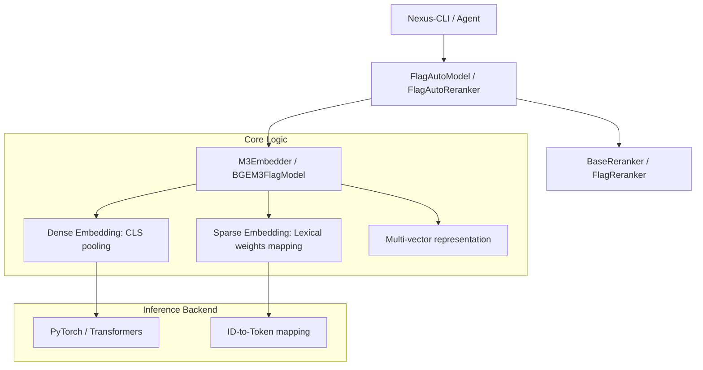
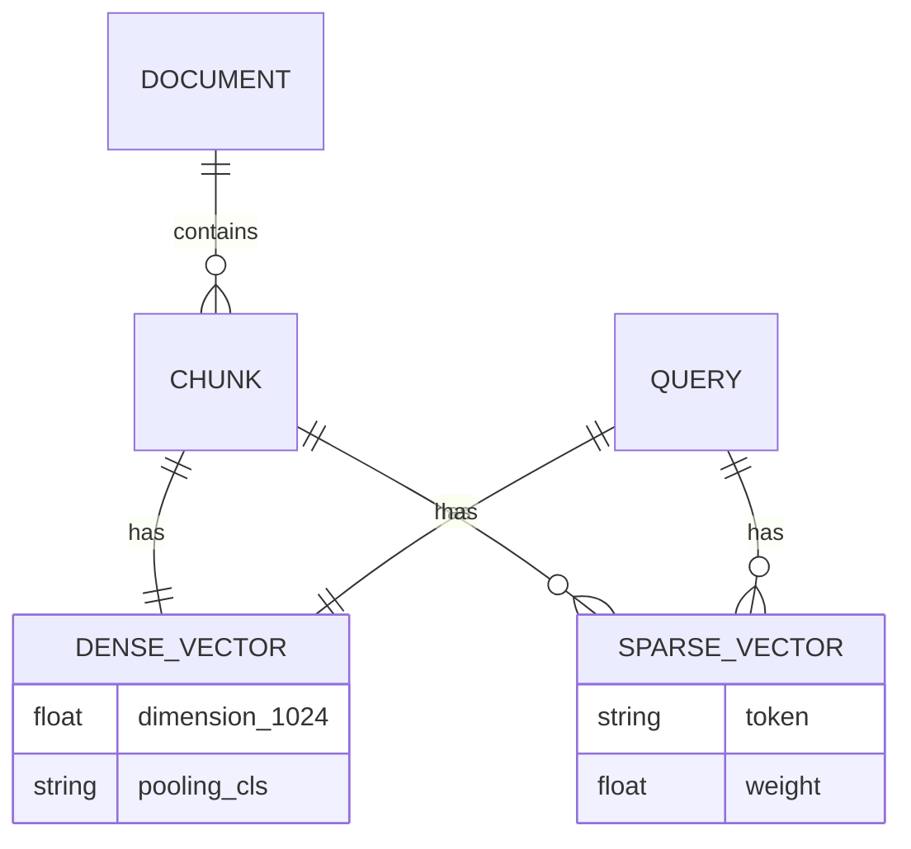

# FlagEmbedding Research Report

## 1. Executive Summary
`FlagEmbedding` is the official toolkit for BGE (BAAI General Embedding) models. It provides high-performance inference and fine-tuning capabilities for state-of-the-art embedding and reranking models. For Nexus-CLI, the most critical component is the **BGE-M3** model, which unifies dense, sparse (lexical), and multi-vector (ColBERT) retrieval in a single model.

## 2. Architecture Diagram

## 3. Data Model (BGE-M3 Representations)

## 4. Key Implementation Details
- **Unified Encoding**: `M3Embedder.encode` can return `dense_vecs`, `lexical_weights`, and `colbert_vecs` in a single pass.
- **Lexical Weights**: The sparse embedding is not a traditional vector but a dictionary of token weights.
  - Logic: `_process_token_weights` extracts weights for non-special tokens.
- **Reranking**: `BaseReranker` uses a Cross-Encoder architecture (`AutoModelForSequenceClassification`) to compute a relevance score for `(query, passage)` pairs.

## 5. Insights for Nexus-CLI
- **Memory Management**: Always use `use_fp16=True` during initialization to reduce memory usage by ~50% without significant loss in accuracy.
- **Hybrid Scoring**: Nexus-CLI should store both Dense (1024-dim) and Sparse (Lexical weights) in Qdrant.
  - Insight: Qdrant's Hybrid Search can utilize these weights directly for lexical matching.
- **Token Handling**: Leverage the `BGEM3FlagModel` to automatically handle multi-lingual inputs, as it's pre-trained on 100+ languages.
- **Batching**: Use the provided batching logic in `encode_single_device` to handle large ingestion tasks efficiently.
