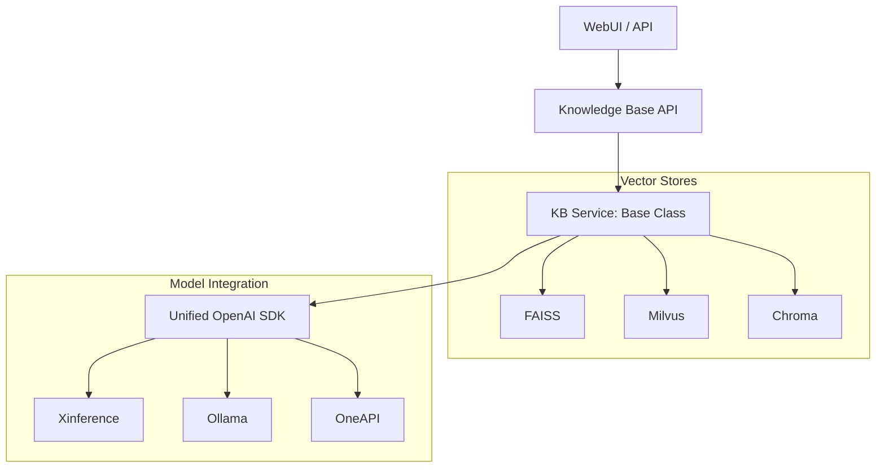
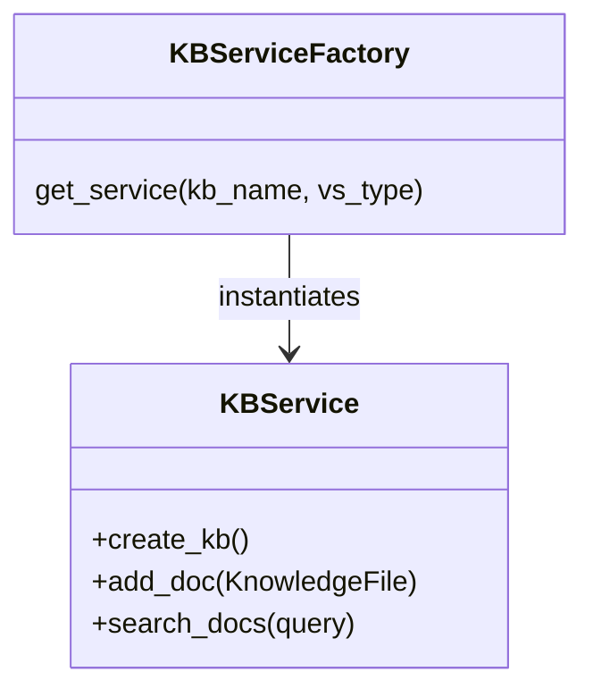

# Langchain-Chatchat Research Report

## 1. Executive Summary
`Langchain-Chatchat` is a comprehensive open-source RAG and Agent framework. It is notable for its **inference-agnostic** design, supporting multiple model deployment frameworks (Xinference, Ollama, etc.) through a unified API. Component modularity and structured configuration management are its key architectural highlights.

## 2. Architecture Diagram (Multi-Model RAG)

## 3. Data Model (Service Factory)

## 4. Key Implementation Details
- **Unified Embedding SDK**: All model interactions are normalized to follow the OpenAI SDK pattern, regardless of the backend (Ollama, Xinference).
- **Service-Repository Pattern**: Separates the vector store logic (`KBService`) from the metadata management (SQLAlchemy repositories).
- **YAML Hot-Reloading**: All system settings are stored in YAML files. The application monitors these files for changes and reloads configurations without requiring a restart.
- **Hybrid Retrieval**: Supports advanced retrieval modes including BM25 + KNN (Vector search) to improve recall.

## 5. Insights for Nexus-CLI
- **Inference Agnostic Model**: Even if Nexus-CLI starts with local BGEM3, wrapping model calls in a "Provider" abstraction will allow future support for external APIs or Ollama.
- **Unified Configuration**: Adopt YAML for CLI configuration (`nexus_settings.yaml`). It's more human-readable and allows for complex nested settings.
- **Service Factory**: Use a factory pattern for the Search and Ingest services. This will allow the CLI to switch between different "engines" (e.g., Local Qdrant vs. Remote Qdrant) seamlessly.
- **Rich Metadata Sync**: Maintain a local metadata database (SQLite or JSON) to track file-to-point mappings, which is essential for managing document deletions and updates in the vector store.
