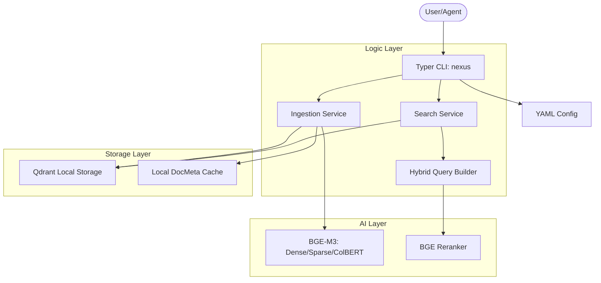

# Nexus-CLI: Cross-Repository Research Synthesis

## 1. Overview
This report synthesizes technical insights from 8 reference repositories to define the architectural and functional strategy for **Nexus-CLI**, a local hybrid search tool for AI agents.

## 2. Strategic Pillars

### A. Core Engine (FlagEmbedding + Qdrant)
- **Hybrid Vectors**: Use BGE-M3 to generate **Dense**, **Sparse**, and **ColBERT** vectors.
- **Efficient Querying**: Implement Qdrant's `QueryRequest` with `Prefetch` to perform multi-stage hybrid search (Lexical -> Semantic -> Rerank) in a single atomic call.
- **Local First**: Default to `QdrantClient(path="~/.nexus/db")` for zero-setup portability.

### B. Ingestion Strategy (Khoj + semtools)
- **Incremental Sync**: Track file state using `(path, size, mtime)` hashes. Skip re-embedding unchanged files to save compute.
- **Context Preservation**: Use recursive character splitting and prepend truncated section headings to chunks (derived from `khoj`) to maintain semantic context.
- **Deterministic IDs**: Use MD5 hashes of chunk content + file path as Qdrant point IDs to ensure idempotency and prevent duplicates.

### C. CLI & UX Design (hive + semtools)
- **Rich Interface**: Utilize `Rich.Panel` and `Rich.Table` for search results to ensure they are readable for both human users and AI agents (who parse markdown).
- **Workspace Management**: Adopt the `SEMTOOLS_WORKSPACE` pattern to allow users to switch between different project contexts isolated in distinct database folders.
- **Progress Visibility**: Use custom spinners (e.g., `BeeStatus` style) during long-running ingestion or model loading phases.

### D. Architecture (private-gpt + Langchain-Chatchat)
- **Service Modularization**: Decouple the `SearchService` and `IngestService` from the `Typer` CLI interface to allow for future API or WebUI expansion.
- **Structured Config**: Use YAML (`nexus_settings.yaml`) for system-wide configurations, allowing hot-reloading and easy manual overrides.

## 3. High-Level Architecture for Nexus-CLI

## 4. Key Recommendations
1. **Prioritize the "jump to line" feature**: By storing line numbers in metadata (as seen in `khoj`), we make the tool significantly more useful for legal and technical auditing.
2. **Implement BM25 pre-filtering**: Use Qdrant's sparse vectors for lexical search to filter the initial candidate set before running dense semantic search.
3. **Zero-Configuration Entry**: Ensure the tool can be run immediately after `pip install` by bundling or auto-downloading necessary models and initializing a local Qdrant instance.
