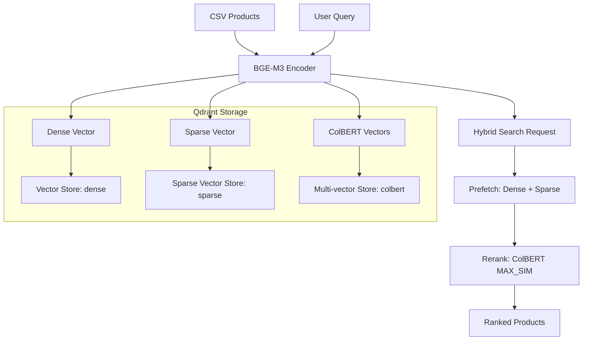
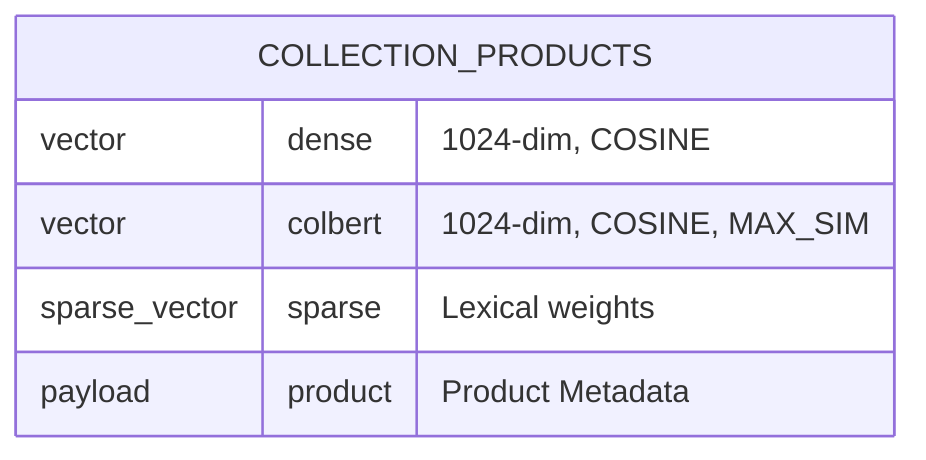

# BGE-M3 Qdrant Sample Research Report

## 1. Executive Summary
This repository provides a concrete implementation of a hybrid search system combining **Dense**, **Sparse**, and **ColBERT** vectors using BGE-M3 and Qdrant. It demonstrates the full lifecycle: data loading, embedding generation, Qdrant collection configuration, and complex multi-stage querying.

## 2. Architecture Diagram


## 3. Data Model (Qdrant Schema)


## 4. Key Implementation Details
- **Sparse Vector Conversion**:
  ```python
  def create_sparse_vector(sparse_data):
      # BGE-M3 returns {id: weight}. Qdrant needs parallel lists.
      indices = [int(k) for k, v in sparse_data.items() if float(v) > 0]
      values = [float(v) for k, v in sparse_data.items() if float(v) > 0]
      return models.SparseVector(indices=indices, values=values)
  ```
- **Hybrid Query Pattern**:
  ```python
  prefetch = [
      models.Prefetch(query=sparse_vec, using="sparse", limit=10),
      models.Prefetch(query=dense_vec, using="dense", limit=10)
  ]
  results = client.query_points(
      collection_name,
      prefetch=prefetch,
      query=colbert_vec, # Reranking step
      using="colbert",
      limit=3
  )
  ```

## 5. Insights for Nexus-CLI
- **Implementation Strategy**: Use the "Prefetch" pattern for hybrid retrieval. Combining BM25-like (Sparse) and Semantic (Dense) search before an expensive reranking step is the optimal architecture for accuracy.
- **Qdrant Config**: For local deployment, ensure `on_disk=True` for Sparse vectors to keep RAM usage low.
- **Reranking Choice**: The sample uses ColBERT vectors for reranking. This is a "local" reranking option. Alternatively, a dedicated Cross-Encoder (FlagReranker) can be used after retrieval. Nexus-CLI should support both.
