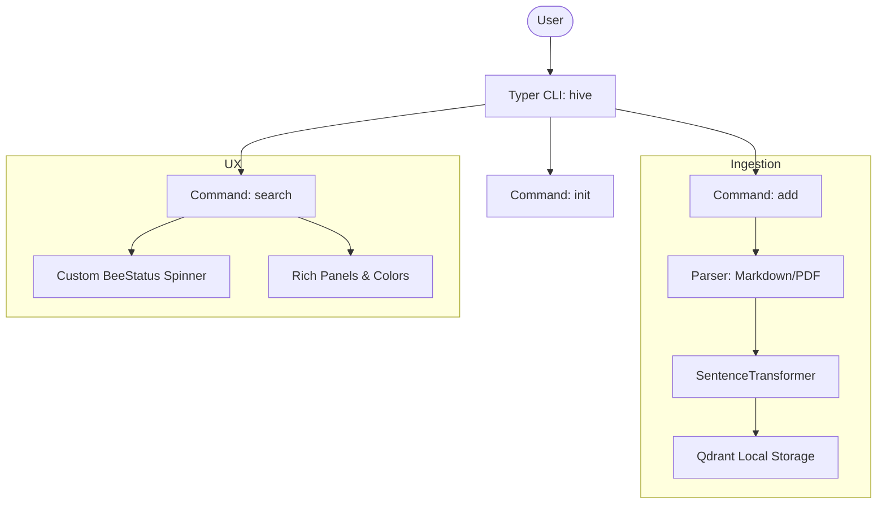
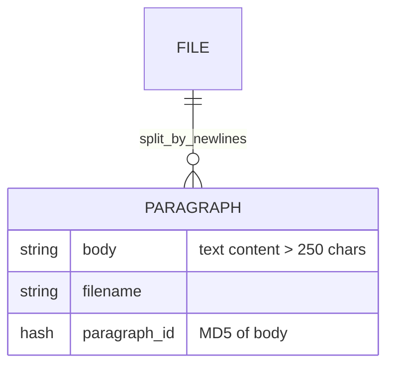

# hive Research Report

## 1. Executive Summary
`hive` is a lightweight semantic search CLI tool. It excels at providing a clean, user-friendly interface using `Typer` and `Rich`. It serves as an excellent reference for CLI aesthetics, basic document parsing, and local Qdrant persistence.

## 2. Architecture Diagram (CLI Flow)


## 3. Data Model (Text Processing)


## 4. Key Implementation Details
- **CLI Aesthetics**: Uses `Rich` for spinners and result panels.
  ```python
  panel = Panel(
      body,
      title=f"[bold]{item['filename']}[/bold]",
      subtitle=f"Match score: {item['match_score']:.0f}%",
      border_style="#ffa908", # Hive yellow
  )
  ```
- **Document Parsing**: Implements a simple but effective paragraph splitter for Markdown that preserves headers.
- **Initialization**: Dedicated `init` command to download models and set up the Qdrant collection, which prevents runtime errors during the first search.

## 5. Insights for Nexus-CLI
- **UX Excellence**: Adopt the `Rich` panel approach for search results. It makes the output readable for both humans and agents.
- **Custom Spinners**: Use a theme-appropriate spinner (like Nexus-CLI equivalent) to indicate progress during model loading and ingestion.
- **Deduplication**: Use `hashlib.md5(body.encode()).hexdigest()` as the point ID in Qdrant to avoid duplicate entries for the same content across multiple `add` commands.
- **Atomic Ingestion**: The `add` command should support both individual files and directories recursively.
