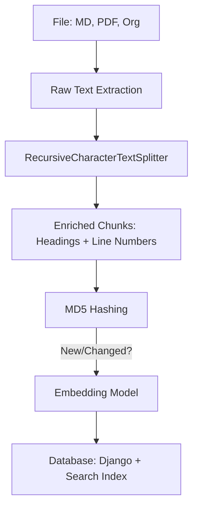
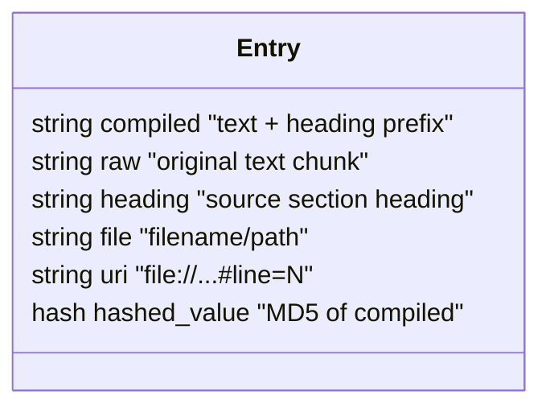

# khoj Research Report

## 1. Executive Summary
`khoj` is a personal AI secondary brain designed for private, localized search across multiple sources (Obsidian, Emacs, PDF, etc.). Its core strength lies in its **incremental indexing pipeline** and **metadata-rich chunking**, which ensures search results are both fast and contextually relevant.

## 2. Architecture Diagram (Ingestion Pipeline)

## 3. Data Model (Enriched Entry)

## 4. Key Implementation Details
- **Smart Line Numbering**: Calculates precise line numbers for each chunk by locating its position in the original raw text. This allows "jump to source" features in the UI.
- **Recursive Chunking**: Uses `separators=["\n\n", "\n", "!", "?", ".", " ", "\t", ""]` to split text at natural boundaries, keeping pieces within the model's token limit.
- **Context Injection**: Prepends the last 100 characters of the relevant section heading to each subsequent chunk. This prevents "context loss" in middle-of-the-page chunks.
- **Incremental Updates**: Compares MD5 hashes of new chunks against the database. It only re-embeds what has actually changed, drastically reducing compute for large knowledge bases.

## 5. Insights for Nexus-CLI
- **Line-Level Accuracy**: Nexus-CLI should preserve line numbers in its Qdrant payload. This is essential for legal research (e.g., "See Line 12 of Document X").
- **Recursive Splitting**: Adopt the `RecursiveCharacterTextSplitter` pattern to ensure chunks don't cut off words or sentences abruptly.
- **Heading Prepending**: For legal documents with clear hierarchical structures (Articles, Sections), prepending the current section title to every chunk within that section will improve search relevance.
- **Deterministic Hashing**: Use MD5 hashing for point IDs in Qdrant to enable incremental indexing and prevent duplicate vectors.
