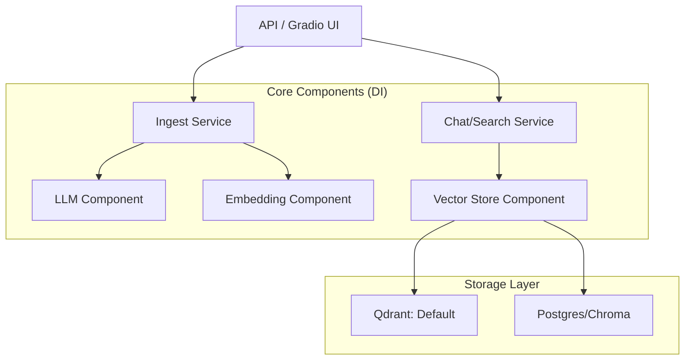
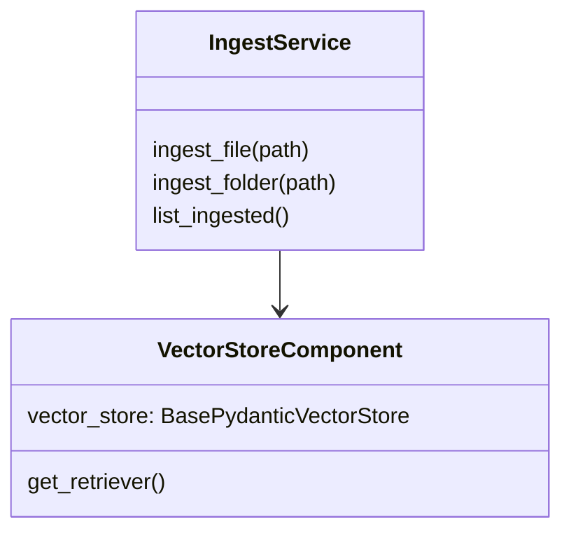

# private-gpt Research Report

## 1. Executive Summary
`private-gpt` is a production-ready RAG application that provides an OpenAI-compatible API for local document interaction. It is built on **FastAPI** and **LlamaIndex**, demonstrating how to scale a simple RAG script into a modular, enterprise-grade system.

## 2. Architecture Diagram (Modular RAG)

## 3. Data Model (Component Lifecycle)

## 4. Key Implementation Details
- **Dependency Injection**: Uses `injector` to manage singleton instances of LLMs and vector stores, ensuring that heavy models are loaded only once.
- **FastAPI Routing**: The UI and API are decoupled, allowing for multiple frontends (Gradio, CLI, Web) to use the same underlying services.
- **LlamaIndex Abstractions**: By using `BaseEmbedding` and `VectorStore` interfaces, the project can switch between Ollama, OpenAI, Qdrant, and Milvus with minimal code changes.
- **Watch Service**: Implements an `IngestWatcher` that monitors local folders and triggers ingestion automatically when new files are added.

## 5. Insights for Nexus-CLI
- **Modular Services**: Even for a CLI, keep the core search and ingestion logic in separate "Service" classes. This makes testing easier and allows for future API wrappers.
- **Settings Management**: Adopt a structured settings approach (like `settings.yaml`) to handle API keys, local paths, and model configurations.
- **Doc-Level Filtering**: Use metadata filters (e.g., `doc_id`) during search to allow users to scope their search to specific files or "workspaces" within a single Qdrant collection.
- **LlamaIndex as Foundation**: Since we are using BGE-M3 and Qdrant, LlamaIndex's `QdrantVectorStore` and `BGEM3Embedding` classes should be investigated as potential core libraries to speed up development.
