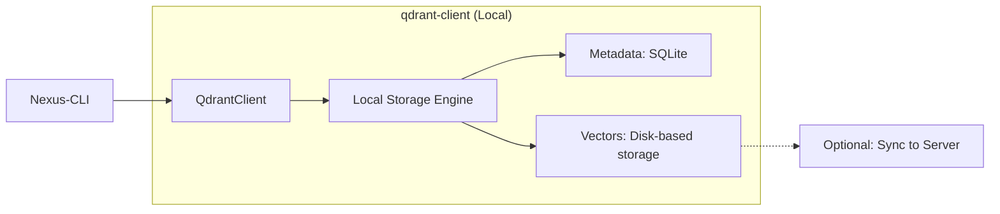
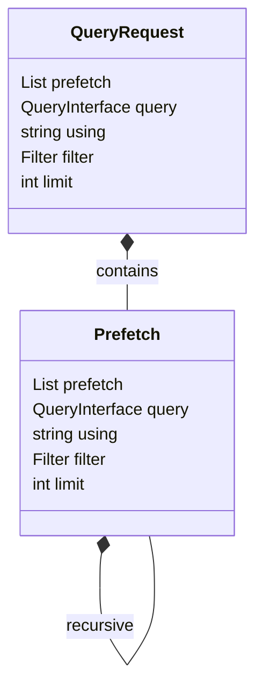

# qdrant-client Research Report

## 1. Executive Summary
`qdrant-client` is the official Python SDK for Qdrant. For Nexus-CLI, its most critical feature is the **Local Mode**, which allows running a full vector database using only local disk storage without a Docker container or server. It also provides the `Query API` (v1.10+), which is highly optimized for hybrid search through `Prefetch` objects.

## 2. Architecture Diagram (Local Mode)


## 3. Data Model (Core Query Objects)


## 4. Key Implementation Details
- **Local Persistence**:
  ```python
  from qdrant_client import QdrantClient
  client = QdrantClient(path="./nexus_db") # Critical for zero-setup
  ```
- **The "Prefetch" Pattern**:
  Allows executing multiple search stages in a single network/local call.
  - Stage 1: Lexical search (Sparse)
  - Stage 2: Semantic search (Dense)
  - Stage 3: Combination/Reranking (ColBERT or Cross-Encoder)
- **Batch Operations**: `upload_collection` is significantly faster than individual `upsert` calls as it handles internal batching and parallelization.

## 5. Insights for Nexus-CLI
- **Zero-Dependency**: Nexus-CLI should default to `QdrantClient(path="~/.nexus/db")`. This eliminates the need for Docker during development and usage.
- **Advanced Hybrid Search**: Implement the `QueryRequest` with multiple `Prefetch` items. This is more efficient than the older `search` + `search` + manual combine approach.
- **Type Safety**: Leverage the `qdrant_client.models` for all parameters to ensure consistent API usage and benefit from IDE autocompletion.
- **Async Support**: While the CLI is synchronous by nature, using `AsyncQdrantClient` in ingestion scripts could improve performance for bulk processing.
