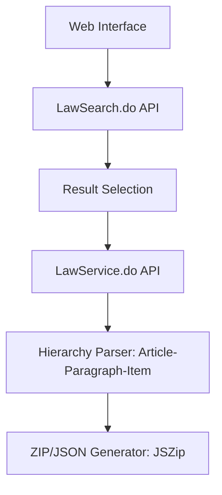

# searchlaw.html Research Report

## 1. Executive Summary
`searchlaw.html` is a client-side downloader and explorer for South Korean legal documents, powered by the **National Law Information Center (국가법령정보센터) Open API**. It provides a robust mechanism for fetching, parsing, and exporting legal statutes and administrative rules in bulk, making it an ideal tool for generating high-quality datasets for RAG performance testing.

## 2. Technical Architecture

## 3. Data Parsing Strategy
The tool implements a recursive flattening logic to handle the deeply nested structure of Korean laws:
- **Statutes (Laws)**: Parsed as `조문` (Article) > `항` (Paragraph) > `호` (Item) > `목` (Sub-item).
- **Administrative Rules**: Often returned as unified `조문내용` (Article Content) or specific `부칙` (Addenda).
- **Metadata Preservation**: Captures metadata such as Enforcement Date (시행일자), Promulgation Date (발령일자), and unique IDs (`MST`, `ID`).

## 4. Key Performance Insights
- **Bulk Downloading**: Uses chunked fetching (5 concurrent requests) to respect API rate limits while maintaining speed.
- **Data Fidelity**: Offers a `flattenContentForDisplay` function that strips HTML while preserving the logical structure and numbering of legal clauses.
- **Export Formats**: Provides raw JSON for structured data processing and formatted TXT (bundled in a ZIP) for immediate LLM/RAG consumption.

## 5. Applications for Nexus-CLI
- **Dataset Generation**: Use this tool to download 100+ related laws as a ZIP set. This serves as the "Gold Standard" test corpus.
- **Chunking Benchmark**: The hierarchical parsing logic in `searchlaw.html` should be used as the reference implementation for the Nexus-CLI ingestion pipeline.
- **Structure-Aware RAG**: By mirroring the `조-항-호-목` structure in Qdrant payloads, Nexus-CLI can provide exact citations for AI responses.
