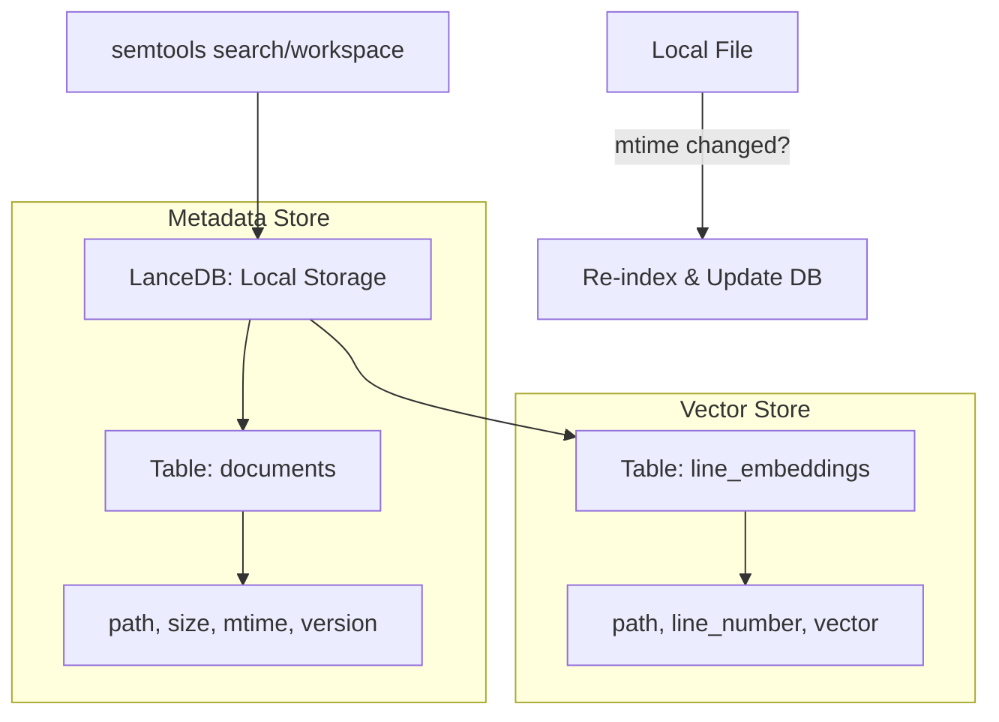
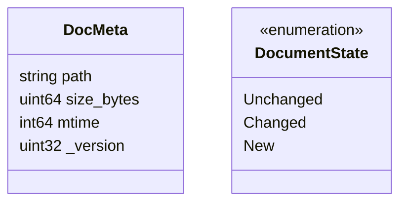

# semtools Research Report

## 1. Executive Summary
`semtools` is a high-performance Rust-based CLI for document parsing and semantic search. It introduces a robust **Workspace** concept that manages embedding caches and document metadata locally. It is particularly useful for its Unix-style piping support and efficient file state tracking.

## 2. Architecture Diagram (Workspace & Cache)

## 3. Data Model (File Change Tracking)

## 4. Key Implementation Details
- **Deterministic IDs**: Generates point IDs by hashing the file path and line number. This allows consistent `upsert` operations even when files move or change.
- **State Analysis**: Before embedding, it compares current file metadata (`mtime`, `size`) with the stored `DocMeta`. If identical, it skips processing.
- **Versioning**: Each stored embedding has a `_version` ID. If the model is upgraded (e.g., from v1 to v2), the system can detect and re-index only the outdated entries.
- **LlamaParse Integration**: Leverages an external API for high-quality Markdown conversion of complex PDFs.

## 5. Insights for Nexus-CLI
- **Smart Ingestion**: Implement a table in Qdrant (or a local JSON/SQLite file) to store `(path, mtime, size)`. Skip re-embedding if these match.
- **Path-based Hash IDs**: Use deterministic hashing for IDs instead of random UUIDs to ensure idempotency.
- **Piping Support**: Ensure Nexus-CLI can read from `stdin`, allowing patterns like `cat doc.txt | nexus search -`.
- **Workspace Context**: Use an environment variable (e.g., `NEXUS_WORKSPACE`) or a local `.nexus` config to automatically switch between different databases.
