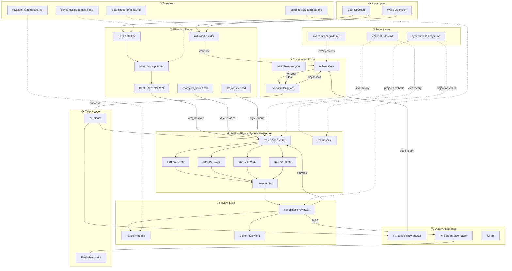
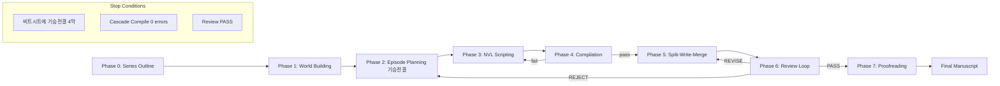

# NVL Agent Suite - System Architecture

## Overview

This document defines the complete system architecture for the NVL Novel Writing Agent Suite.  
**Priority Rule**: Project-specific rules (e.g., `cyberfunk-noir-style.md`) override generic rules.

---

## System ERD (Entity Relationship Diagram)



---

## Phase Dependency Chain



---

## Skill Routing Table (Updated)

| Phase | Skill | Input | Output | Rules Applied |
|:------|:------|:------|:-------|:--------------|
| 0 | (manual) | User direction | `series-outline.md` | series-outline-template |
| 1 | `nvl-world-builder` | Direction | `world.nvl` | - |
| 2 | `nvl-episode-planner` | EpisodePack, Outline | `ep{N}/beatsheet.md` | beat-sheet-template |
| 3 | `nvl-architect` | Direction + Diagnostics | `ep{N}.nvl` | compiler-guide.md |
| 4 | `nvl-compiler-guard` | NVL code | Compile log | compiler-rules.yaml |
| 5 | `nvl-episode-writer` | NVL + Beatsheet | `ep{N}/part_*.txt` | editorial-rules.md, style.md |
| 6 | `nvl-episode-reviewer` | Merged draft | Review notes | editor-review-template |
| 7 | `nvl-korean-proofreader` | Draft | Final prose | editorial-rules.md |

---

## Rules Priority (High → Low)

1. **Project-Specific** (`cyberfunk-noir-style.md`, `style.md`)
2. **Compiler Rules** (`compiler-rules.yaml`, `nvl-compiler-guide.md`)
3. **Editorial Theory** (`editorial-rules.md`)
4. **Skill SKILL.md** (per-skill instructions)

---

## Templates

| Template | Purpose | Used By |
|:---------|:--------|:--------|
| `series-outline-template.md` | 시리즈 전체 아크 기획 | Phase 0 |
| `beat-sheet-template.md` | 기승전결 비트시트 | nvl-episode-planner |
| `editor-review-template.md` | 리뷰 형식 표준화 | nvl-episode-reviewer |
| `revision-log-template.md` | 수정 이력 추적 | Review Loop |

---

## Split-Write-Merge Workflow

```
ep{N}/
├── beatsheet.md       (기승전결 비트시트)
├── part_01_기.txt     (~3-4KB, 기-도입)
├── part_02_승.txt     (~3-4KB, 승-전개)
├── part_03_전.txt     (~3-4KB, 전-전환점)
├── part_04_결.txt     (~3-4KB, 결-결말)
├── _merged.txt        (병합본)
├── review_r1.md       (리뷰 라운드 1)
└── revision-log.md    (수정 이력)
```

**Purpose**: 5KB 파일 크기 제한 대응
