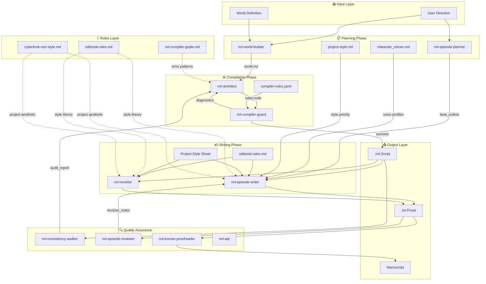
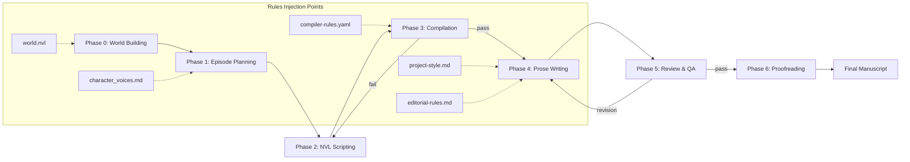

# NVL Agent Suite - System Architecture

## Overview

This document defines the complete system architecture for the NVL Novel Writing Agent Suite.  
**Priority Rule**: Project-specific rules (e.g., `cyberfunk-noir-style.md`) override generic rules.

---

## System ERD (Entity Relationship Diagram)



---

## Phase Dependency Chain



---

## Skill Routing Table (Updated)

| Phase | Skill | Input | Output | Rules Applied |
|:------|:------|:------|:-------|:--------------|
| 0 | `nvl-world-builder` | User direction | `world.nvl` | - |
| 1 | `nvl-episode-planner` | EpisodePack | `epXX_plan.md` | character_voices.md |
| 2 | `nvl-architect` | Direction + Diagnostics | `epXX.nvl` | compiler-guide.md |
| 3 | `nvl-compiler-guard` | NVL code | Compile log | compiler-rules.yaml |
| 4 | `nvl-episode-writer` | NVL + Plan | `epXX.txt` | editorial-rules.md, project-style.md |
| 4 | `nvl-novelist` | Compile log | Prose | editorial-rules.md, project-style.md |
| 5 | `nvl-episode-reviewer` | Draft | Review notes | editorial-rules.md |
| 5 | `nvl-consistency-auditor` | NVL | Audit report | - |
| 6 | `nvl-korean-proofreader` | Draft | Final prose | editorial-rules.md |

---

## Rules Priority (High → Low)

1. **Project-Specific** (`cyberfunk-noir-style.md`)
2. **Compiler Rules** (`compiler-rules.yaml`, `nvl-compiler-guide.md`)
3. **Editorial Theory** (`editorial-rules.md`)
4. **Skill SKILL.md** (per-skill instructions)

---

## Integration Points

### Style Sheet Integration
```
nvl-episode-writer/SKILL.md
└── Line 27: "Genre: Noir / Cyberpunk / Gritty"
    └── NOW REFERENCES: rules/cyberfunk-noir-style.md
```

### Character Voice Integration
```
nvl-episode-planner/SKILL.md
└── Beat outline generation
    └── NOW LOADS: cyberfunk noir/nvl/character_voices.md
```

### Pacing Metrics Integration
```
nvl-compiler-guide.md
└── Event Density Mandate
    └── NOW INCLUDES: Prose pacing targets (words per scene type)
```
